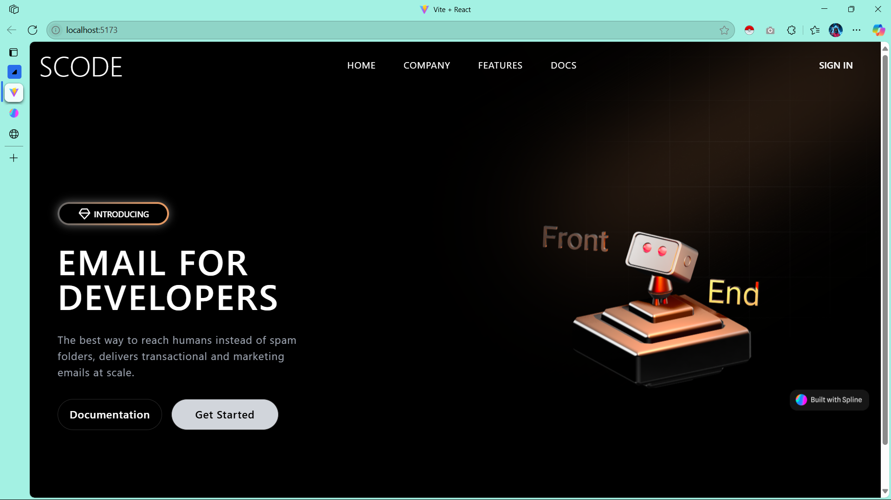

<p align="center">
  
</p>

<h1 align="center">🤖 SCODE – 3D Robo Landing Page</h1>
<p align="center">Email infrastructure for developers, powered by a beautiful 3D landing experience.</p>

<p align="center">
  <a href="#features">Features</a> •
  <a href="#tech-stack">Tech Stack</a> •
  <a href="#getting-started">Getting Started</a> •
  <a href="#usage">Usage</a> •
  <a href="#contributing">Contributing</a> •
</p>

---

## 📌 Overview

**SCODE** is a developer-first platform focused on making email delivery modern, scalable, and spam-proof. This project is a sleek, futuristic **landing page** built with modern 3D visuals using **Spline**, showcasing the SCODE product experience.

---

## ✨ Features

- 💌 Focused on Email APIs for developers
- 🧠 Futuristic 3D robot built with **Spline**
- ⚡ Fast Vite + React setup
- 📱 Fully responsive layout
- 🎨 Dark mode design
- 🧩 Reusable component structure

---

## 🧱 Tech Stack

| Layer         | Technology                        |
|--------------|------------------------------------|
| Frontend      | React, Vite, Tailwind CSS          |
| 3D Assets     | **Spline**                         |

---

## 🚀 Getting Started

### Prerequisites

- Node.js (v16+)
- npm or yarn
- Git

### Installation

```bash
# Clone the repository
git clone https://github.com/your-username/3d-robo-landing.git

# Navigate into the project
cd 3d-robo-landing

# Install dependencies
npm install

# Start the local development server
npm run dev
```
Open your browser at http://localhost:5173

## 🛠 Usage
3D Integration (via Spline)
```
import Spline from '@splinetool/react-spline';
<Spline scene="https://prod.spline.design/your-scene-url/scene.splinecode" />
```
🤝 Contributing
Contributions are welcome!
1. Fork this repo
2. Create your feature branch (git checkout -b feature/awesome)
3. Commit your changes (git commit -m 'Add amazing feature')
4. Push to the branch (git push origin feature/awesome)
5. Open a pull request 🚀


<p align="center"> Made with ❤️ by [Your Name or Team Name] </p>
